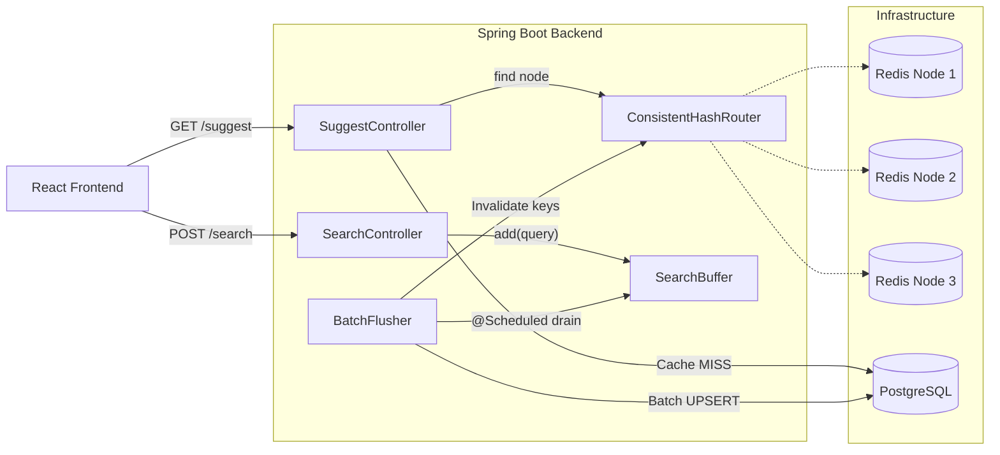

# Search Typeahead System

A production-inspired **search autocomplete system** built as a High-Level Design (HLD) assignment. It implements the full stack — from a PostgreSQL-backed prefix search with 1.24M+ queries, through a distributed Redis cache layer with consistent hashing, to a React frontend with debounced typeahead. Write throughput is optimized via an in-memory batch buffer that collapses high-frequency searches into periodic bulk UPSERTs, reducing DB load by 6–10× in testing.

---

## Tech Stack

| Layer | Technology | Version |
|-------|-----------|---------|
| Backend | Spring Boot | 3.2.6 |
| Language | Java | 17 |
| Database | PostgreSQL (Docker image `postgres:15-alpine`) | 15 |
| Cache | Redis (Docker image `redis:7-alpine`) | 7 |
| Frontend | React | 19.2.6 |
| Frontend tooling | Vite | 8.0.12 |
| ORM | Spring Data JPA / Hibernate | 6.4.8 (via Boot 3.2.6) |
| Redis client | Spring Data Redis / Lettuce | (via Boot 3.2.6) |
| Build | Maven | 3.8+ |

---

## Prerequisites

| Tool | Required Version | How to check |
|------|-----------------|-------------|
| Docker Desktop | Any recent | `docker --version` |
| Java JDK | 17+ | `java -version` |
| Maven | 3.8+ | `mvn -version` |
| Node.js | 18+ | `node --version` |
| npm | 9+ | `npm --version` |

---

## Setup Instructions

### 1 — Clone the repository

```bash
git clone https://github.com/AUXID-01/HLD-Assignment.git
cd HLD-Assignment/search-typeahead
```

### 2 — Start infrastructure (PostgreSQL + 3 Redis nodes)

```bash
docker-compose up -d
```

This starts four containers:

| Container | Service | Host Port |
|-----------|---------|-----------|
| `typeahead-postgres` | PostgreSQL 15 | `5432` |
| `typeahead-redis-1` | Redis 7 | `6379` |
| `typeahead-redis-2` | Redis 7 | `6380` |
| `typeahead-redis-3` | Redis 7 | `6381` |

Confirm all four are running:
```bash
docker ps
```

### 3 — Start the backend

```bash
cd backend
mvn spring-boot:run
```

Wait for the log line:
```
Started SearchApplication in X.XXX seconds
```

The backend listens on **http://localhost:8081**.

> **First boot only:** `DataLoader` automatically reads `queries_aggregated.csv` from the classpath and bulk-inserts rows into PostgreSQL in batches of 10,000. This takes a few seconds. On every subsequent boot, it detects that the table is non-empty and skips loading entirely.

### 4 — Start the frontend

Open a **second terminal**:

```bash
cd frontend
npm install      # first time only
npm run dev
```

The frontend runs on **http://localhost:5173**.

Open your browser at **http://localhost:5173** and start typing.

---

## Dataset

### Source
`backend/src/main/resources/data/queries_aggregated.csv` — a pre-aggregated extract of anonymized search queries with their historical counts and timestamps.

### CSV Schema

```
query,count,last_searched_at
"iphone 13",4821,2024-03-15 14:23:00
playstation 5,3107,2024-03-10 09:41:00
...
```

| Column | Type | Description |
|--------|------|-------------|
| `query` | string | The search term (may contain commas; outer-quoted if so) |
| `count` | integer | Cumulative all-time search count |
| `last_searched_at` | `yyyy-MM-dd HH:mm:ss` | Timestamp of the most recent search event |

### Auto-loading behaviour (`DataLoader.java`)

On startup, `DataLoader` (a `CommandLineRunner`) runs:

```java
if (queryRepository.count() > 0) {
    // table already populated — skip
    return;
}
// Otherwise: batch-insert from CSV in chunks of 10,000 rows
```

The insert SQL is:
```sql
INSERT INTO queries (query, count, last_searched_at) VALUES (?, ?, ?)
ON CONFLICT (query) DO NOTHING
```

### Pointing at a different dataset

Change the path in `application.properties`:

```properties
# Default (classpath resource):
app.dataset.path=classpath:data/queries_aggregated.csv

# Absolute file on disk:
app.dataset.path=file:/path/to/your/custom.csv
```

The CSV must match the three-column schema above (header row required). To force a reload after changing the dataset, truncate the table first:
```sql
TRUNCATE TABLE queries;
```

---

## API Reference

### `GET /suggest` — Autocomplete suggestions

Returns up to 10 matching queries for a given prefix.

| Parameter | Type | Required | Default | Description |
|-----------|------|----------|---------|-------------|
| `q` | string | yes | — | Search prefix (e.g. `"iph"`) |
| `mode` | string | no | `basic` | `basic` = sorted by `count DESC`; `trending` = exponential decay score |

**Basic mode** — straight `count DESC`, identical to the pre-Phase-8 behaviour:
```bash
curl "http://localhost:8081/suggest?q=iph"
```
```json
[
  { "query": "iphone 13",     "count": 4821, "score": null },
  { "query": "iphone 15 pro", "count": 3107, "score": null }
]
```

**Trending mode** — scored by `count × e^(−0.0289 × hours_since_last_searched)`:
```bash
curl "http://localhost:8081/suggest?q=iph&mode=trending"
```
```json
[
  { "query": "iphone 15 pro", "count": 3107, "score": 3094.23 },
  { "query": "iphone 13",     "count": 4821, "score": 12.07 }
]
```

**Response headers (cache observability):**
```
X-Cache: HIT | MISS
X-Cache-Node: redis-node-1 | redis-node-2 | redis-node-3
```

Cache keys: `suggest:basic:<prefix>` and `suggest:trending:<prefix>` — separate keys per mode, both with a **60-second TTL**.

---

### `POST /search` — Record a search event

Buffers the query in memory; the actual DB UPSERT runs on the next scheduled flush (every 10 s, or immediately when the buffer reaches 500 unique entries).

```bash
curl -X POST http://localhost:8081/search \
  -H "Content-Type: application/json" \
  -d '{"query": "iphone 15"}'
```

**Success (HTTP 200):**
```json
{ "message": "Searched" }
```

**Validation error — blank or missing `query` (HTTP 400):**
```json
{ "error": "query cannot be missing or blank" }
```

The response always returns before any DB write occurs. The underlying UPSERT when the flush runs:
```sql
INSERT INTO queries (query, count, last_searched_at)
VALUES (:query, :incrementCount, :lastSearchedAt)
ON CONFLICT (query) DO UPDATE SET
  count = queries.count + :incrementCount,
  last_searched_at = GREATEST(queries.last_searched_at, EXCLUDED.last_searched_at)
```

---

### `GET /batch/debug` — Batch write metrics

```bash
curl "http://localhost:8081/batch/debug"
```
```json
{
  "currentBufferSize": 5,
  "totalSearchesReceived": 53,
  "totalDbWrites": 8,
  "writeReductionRatio": "6.63x",
  "summary": "53 searches in, 8 DB writes out — 6.63x reduction"
}
```

| Field | Meaning |
|-------|---------|
| `currentBufferSize` | Unique queries currently buffered (unflushed) |
| `totalSearchesReceived` | Cumulative POST /search calls since startup |
| `totalDbWrites` | Cumulative UPSERTs executed since startup |
| `writeReductionRatio` | `totalSearchesReceived / totalDbWrites` |

---

### `GET /cache/debug` — Cache ring diagnostic

```bash
curl "http://localhost:8081/cache/debug?prefix=iphone"
```

Returns which Redis node the consistent hash ring routes `suggest:basic:iphone` and `suggest:trending:iphone` to, and whether the key is currently cached.

---

## Architecture



### Components

| Component | Technology | Role |
|-----------|-----------|------|
| React Frontend | React 19 + Vite 8 | Google-style search UI; debounced typeahead (300 ms), keyboard navigation, basic/trending mode toggle |
| Spring Boot Backend | Java 17, Spring Boot 3.2.6 | REST API, cache-aside logic, batch buffer, consistent hash routing |
| PostgreSQL | postgres:15-alpine | Persistent store for all query terms, counts, and timestamps |
| Redis ×3 | redis:7-alpine | Distributed suggestion cache; keys partitioned across 3 nodes via consistent hashing |

### Read path (`GET /suggest`)

1. Frontend fires `GET /suggest?q=<prefix>&mode=<mode>` after 300 ms debounce.
2. Backend normalises prefix to lowercase, constructs cache key `suggest:<mode>:<prefix>`.
3. `ConsistentHashRouter` (MD5 hash, 160 virtual nodes/physical node) deterministically picks one of the 3 Redis nodes.
4. **Cache HIT** → return JSON directly from Redis (`X-Cache: HIT`).
5. **Cache MISS** → query PostgreSQL, write result to Redis with 60 s TTL, return result (`X-Cache: MISS`).

### Write path (`POST /search`)

1. Frontend POSTs `{ "query": "..." }` on Enter / suggestion click.
2. `SearchController` normalises the string and calls `BatchFlusher.record()`.
3. Query is added to an `AtomicReference<ConcurrentHashMap<String, BufferedEntry>>` in-memory buffer (HTTP thread returns `{ "message": "Searched" }` immediately).
4. A `@Scheduled` thread flushes every 10 s (configurable via `batch.flush-interval-ms`), or immediately if the buffer reaches 500 entries (`batch.flush-size`).
5. On flush: one UPSERT per unique query with the aggregated count delta, then Redis cache-key deletions for every prefix of the query in both `basic` and `trending` namespaces.

---

## Configuration Reference

```properties
# application.properties
server.port=8081

spring.datasource.url=jdbc:postgresql://localhost:5432/typeahead
spring.datasource.username=postgres
spring.datasource.password=postgres

# Redis nodes
redis.nodes[0].host=localhost  redis.nodes[0].port=6379  redis.nodes[0].name=redis-node-1
redis.nodes[1].host=localhost  redis.nodes[1].port=6380  redis.nodes[1].name=redis-node-2
redis.nodes[2].host=localhost  redis.nodes[2].port=6381  redis.nodes[2].name=redis-node-3

# Batch write tuning
batch.flush-interval-ms=10000   # time-based flush interval (ms)
batch.flush-size=500            # size-based flush threshold (unique queries)

# Dataset path (change to file:/path/to/custom.csv for external files)
app.dataset.path=classpath:data/queries_aggregated.csv
```

---

## Project Status

| Phase | Feature | Status |
|-------|---------|--------|
| 1 | Spring Boot project skeleton + PostgreSQL JPA entity | ✅ Complete |
| 2 | CSV dataset loader (1.24M+ rows, batch insert 10k/chunk) | ✅ Complete |
| 3 | `GET /suggest` — prefix search, `count DESC`, top 10 | ✅ Complete |
| 4 | `POST /search` — atomic PostgreSQL UPSERT (insert or increment) | ✅ Complete |
| 5 | Redis cache-aside on `/suggest` (single node, 60 s TTL) | ✅ Complete |
| 6 | 3-node Redis + consistent hashing (MD5, 160 vnodes/node) | ✅ Complete |
| 7 | React frontend (Google-style UI, debounce, keyboard nav) | ✅ Complete |
| 8 | Trending mode — exponential decay scoring (`λ=0.0289`, 24 h half-life) | ✅ Complete |
| 9 | Batch writes — in-memory buffer + `@Scheduled` flush, write-reduction metrics | ✅ Complete |

---

## Troubleshooting

| Symptom | Likely cause | Fix |
|---------|-------------|-----|
| `Connection refused` on backend start | Docker containers not running | `docker-compose up -d` |
| `Port 8081 already in use` | Another process on 8081 | Kill it or edit `server.port` in `application.properties` |
| `/suggest` returns `[]` for any prefix | Dataset not loaded | Look for `"Data load complete"` in backend log; if absent, check that the CSV file exists in `src/main/resources/data/` |
| `X-Cache` always `MISS` | Redis containers stopped | `docker ps`; restart with `docker-compose up -d` |
| Frontend shows "Something went wrong" | Backend not running | Run `mvn spring-boot:run` in `backend/` |
| Trending scores all very small | `last_searched_at` values in the dataset are old | Run `POST /search` for those queries to update their timestamps, then wait 10 s for a flush |
